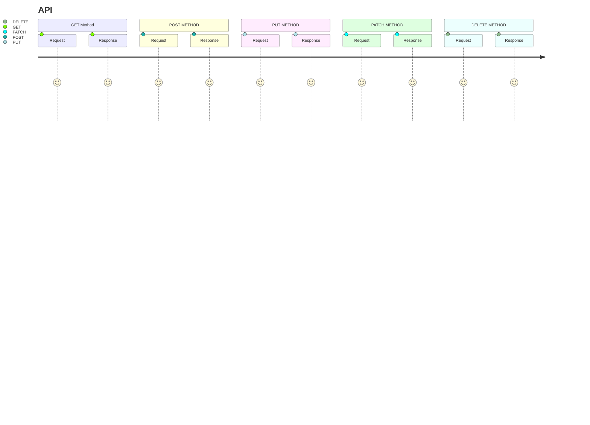

# Week 8 MERN Eduwork
Diminggu ini belajar tentang :
**NODE JS & Express JS**

## NODE JS
Node JS merupakan sebuah engine yg berjalan di server dengan bahasa ***Javascript*** dengan bantuan engine **V8** yg menggunakan bahasa ***C++*** untuk `mengcompiler` bahasa ***Javascript*** agar dapat berjalan diserver sehingga tidak hanya berjalan di web saja
## EXPRESS JS
Express js merupakan sebuah tools framework  unopiniated, middleware... untuk mempermudah pembuatan api
**unopiniated** => sebuah framework yg dimana kita bebas berkreasi tanpa banyak dokumentasi
**middleware** => Merupakan sebuah function yah artinya konsepnya functional programming
## Routing
ssadsa
sample
file **route.js**
```javascript
const express = require('express')
const router = express.Router()

// middleware that is specific to this router
router.use((req, res, next) => {
  console.log('Time: ', Date.now())
  next()
})
// define the home page route
router.get('/', (req, res) => {
  res.send('Birds home page')
})
// define the about route
router.get('/about', (req, res) => {
  res.send('About birds')
})
module.exports = router
```
Lalu import di **app.js**
```javascript
const birds = require('./birds')

// ...

app.use('/birds', birds)
```

## API
Belajar tentang basic api
method 


### Get 
**GET** => merupakan sebuah `METHOD` untuk `menerima/retrieve` sebuah resource/data
```javascript
app.get('/', (req, res) => {
  res.send('root')
})
```
**One Callback Function**
```javascript
app.get('/example/a', (req, res) => {
  res.send('Hello from A!')
})
```
**More Than One Callback Function**
```javascript
app.get('/example/b', (req, res, next) => {
  console.log('the response will be sent by the next function ...')
  next()
}, (req, res) => {
  res.send('Hello from B!')
})
```
Untuk lebih detail documentasinya [Routing](https://expressjs.com/en/guide/routing.html):
### Post
**POST** => Merupkan sebuah `METHOD` untuk `membuat|create/mengirimkan` resource/data  dan bernilai baru
> 1. Multer
> 2. Body parser

### Put
**PUT** => Merupakan sebuah `METHOD` untuk `merubah|update/mengirimkan`  resource/data namun hanya `memperbaharui tidak membuat baru`dan merubah secara keseluruhan body

### Patch
**PATCH** => Merupakan sebuah `METHOD` untuk `merubah|update/mengirimkan` resource/data namun hanya `memperbaharui tidak membuat baru` dan mirip seperti **PUT** hanya saja tidak mengubah secara keseluruhan hanya `instance` spesifik saja

### Delete
**DELETE** => Merupakan sebuah `METHOD` untuk `delete|menghapus` resource/data

## Kesimpulan
Sebenarnya backend tentang apa si?
backend adalah untuk mengatur lalu lintas server page apa? resource apa? yang mau dikirim ke frontend/client side
